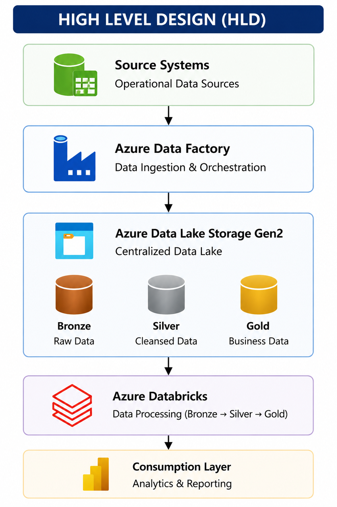
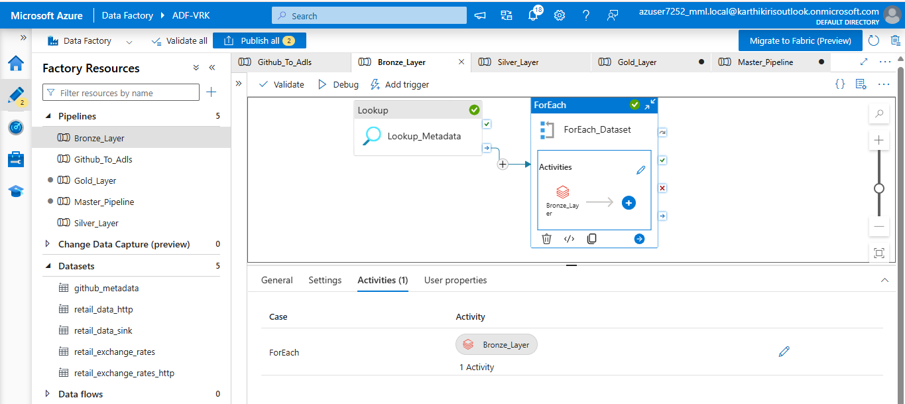
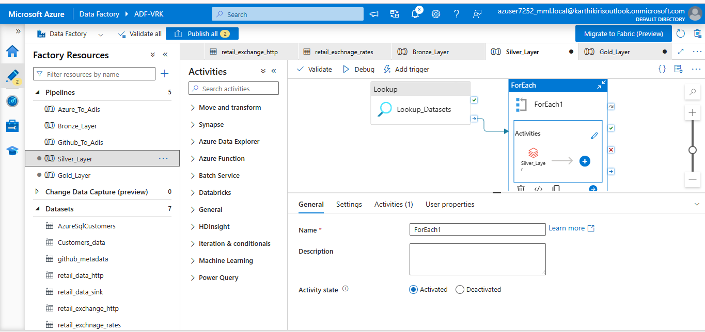
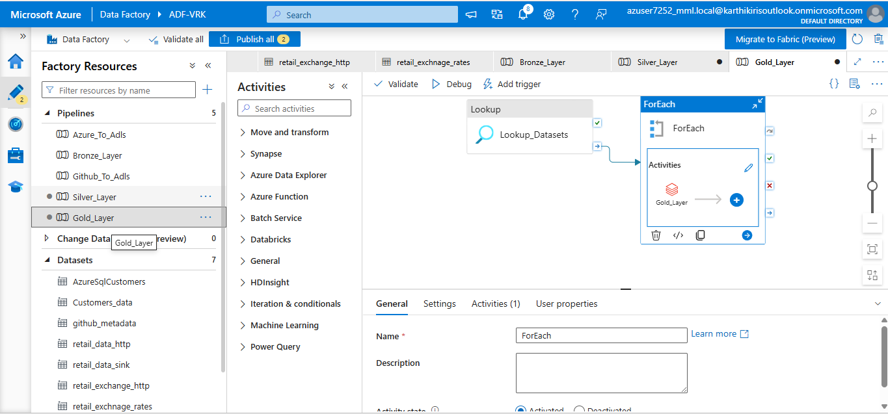
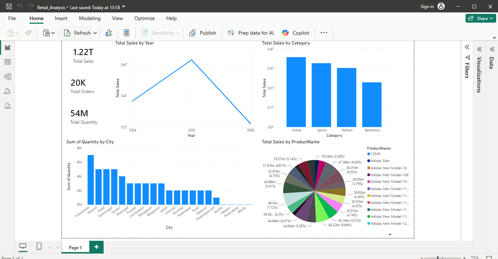
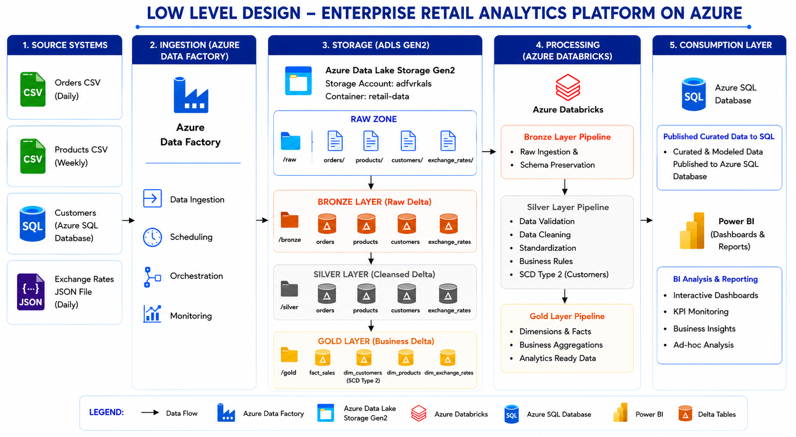

# 🚀 Enterprise Retail Analytics Platform on Azure
<div align="center">

# 🚀 Enterprise Retail Analytics Platform on Azure

### Metadata-Driven End-to-End Azure Data Engineering Solution

[]()
[]()
[]()
[]()
[]()
[]()
[]()

**A Metadata-Driven Azure Data Engineering Platform built using Azure Data Factory, Azure Databricks, ADLS Gen2, Delta Lake, Azure SQL Database, and Power BI.**

</div>

---

> **Enterprise-grade Metadata-Driven Azure Data Engineering Solution built using Azure Data Factory, Azure Databricks, Azure Data Lake Storage Gen2, Delta Lake, Azure SQL Database, and Power BI.**

## 📑 Table of Contents

- 📖 Project Overview
- 🎯 Business Problem
- 💡 Solution Overview
- 🏗️ Solution Architecture
- 💻 Technology Stack
- 📂 Repository Structure
- ⚡ Quick Start
- 🔄 Project Workflow
- ☁️ Azure Resources Required
- 📊 Dataset Information
- ⚙️ Metadata-Driven Framework
- ✨ Project Features
- 🔷 Azure Data Factory Pipelines
- 📘 Databricks Notebooks
- 🥉 Bronze Layer
- 🥈 Silver Layer
- 🥇 Gold Layer
- 🗄️ Azure SQL Publishing
- 📊 Power BI Dashboard
- 🚀 How to Run
- ➕ Adding a New Dataset
- 🛠️ Troubleshooting
- 🚀 Future Improvements
- 👨‍💻 Author

---

# ⚡ Quick Start

```bash
git clone https://github.com/Kalyan31104/<repository-name>.git
cd <repository-name>
```

### Deployment Steps

1. Create Azure Resources.
2. Configure Azure Data Lake Storage Gen2.
3. Upload source datasets to the `raw/` folder.
4. Upload `metadata_config_retail.json` to the `config/` folder.
5. Import Databricks notebooks.
6. Import Azure Data Factory pipelines.
7. Configure Linked Services and pipeline parameters.
8. Execute **Master_Pipeline**.
9. Verify Gold tables in Azure SQL Database.
10. Open the Power BI dashboard.

---

## 📸 Screenshots












---

## 📈 Project Highlights

| Feature | Status |
|---------|:------:|
| Metadata Driven Framework | ✅ |
| Azure Data Factory | ✅ |
| Azure Databricks | ✅ |
| Delta Lake | ✅ |
| Incremental Loading | ✅ |
| SCD Type 2 | ✅ |
| Audit Framework | ✅ |
| Azure SQL Publishing | ✅ |
| Power BI Dashboard | ✅ |

---

# 📖 Project Overview

Modern retail organizations generate large volumes of data every day from multiple operational systems such as sales transactions, customer databases, product catalogs, and external APIs. Since these datasets originate from different sources and formats, they cannot be directly consumed for analytics.

This project demonstrates how to build an **enterprise-grade Azure Data Engineering Platform** capable of ingesting, validating, transforming, and publishing data using Microsoft Azure services.

The solution follows the **Medallion Architecture (Bronze → Silver → Gold)** and is implemented using a **Metadata-Driven Framework**, allowing multiple datasets to be processed dynamically without writing dataset-specific code.

The platform supports:

- Metadata-driven processing
- Dynamic Azure Data Factory pipelines
- Reusable Databricks notebooks
- Watermark-based Incremental Loading
- Slowly Changing Dimension (SCD Type 2)
- Data Quality Validation
- Audit Logging
- Delta Lake
- Azure SQL Publishing
- Power BI Reporting

The entire workflow is orchestrated using Azure Data Factory and processed using Azure Databricks with PySpark.

---
# 🎯 Business Problem

Retail organizations receive business data from multiple independent operational systems every day.

These systems generate:

- Customer information
- Product catalog
- Sales transactions
- Currency exchange rates

Since the data originates from different sources and formats, organizations face several challenges.

## Challenges

- Multiple source systems
- Different file formats (CSV, SQL Database, JSON)
- Duplicate records
- Missing values
- Invalid data
- No centralized storage
- No historical tracking
- Manual ETL process
- No incremental loading
- Poor reporting performance

Without a centralized data platform, generating reliable business insights becomes time-consuming and error-prone.

---

## Business Requirement

The organization requires an automated cloud-based data platform that can:

- Collect data from multiple sources
- Store raw data in a centralized data lake
- Validate and cleanse incoming data
- Maintain historical customer information
- Process only newly arrived records
- Publish curated data for reporting
- Support future dataset onboarding without changing code

---
# 💡 Solution Overview

To address the above business challenges, this project implements an **Enterprise Retail Analytics Platform** on Microsoft Azure.

The platform follows a **Metadata-Driven Architecture**, where all processing rules are maintained in a centralized JSON metadata configuration instead of hardcoding logic inside pipelines or notebooks.

The workflow consists of the following stages:

1. Azure Data Factory ingests data from multiple source systems.
2. Data is stored in Azure Data Lake Storage Gen2.
3. Azure Databricks processes data using the Medallion Architecture.
4. Bronze Layer stores raw Delta tables.
5. Silver Layer performs data validation and cleansing.
6. Gold Layer generates business-ready fact and dimension tables.
7. Curated Gold tables are published to Azure SQL Database.
8. Power BI connects to Azure SQL Database for analytics and reporting.

The Metadata-Driven Framework enables the same pipelines and notebooks to process any dataset by simply updating the metadata configuration.

This significantly reduces maintenance effort and improves scalability.

---
# 🏗️ Solution Architecture

## High Level Design (HLD)


### High-Level Flow

```

Source Systems

↓

Azure Data Factory

↓

Azure Data Lake Storage Gen2

↓

Azure Databricks

↓

Bronze Layer

↓

Silver Layer

↓

Gold Layer

↓

Azure SQL Database

↓

Power BI

```

---

## Low Level Design (LLD)



### Detailed Workflow

- Azure Data Factory orchestrates the complete workflow.
- Data from Azure SQL, CSV files, and REST APIs is ingested into ADLS Gen2.
- Databricks processes data using reusable notebooks.
- Bronze stores raw Delta tables.
- Silver performs schema validation, cleansing, and business rules.
- Gold creates Fact and Dimension tables.
- Curated tables are published to Azure SQL Database.
- Power BI consumes Azure SQL Database for reporting.

---
# 💻 Technology Stack

The project is built using Microsoft Azure cloud services along with open-source technologies to create a scalable and enterprise-ready data engineering platform.

| Category | Technology | Purpose |
|----------|------------|---------|
| Cloud Platform | Microsoft Azure | Cloud Infrastructure |
| Data Orchestration | Azure Data Factory | Data Ingestion & Pipeline Orchestration |
| Data Processing | Azure Databricks | Distributed Data Processing |
| Storage | Azure Data Lake Storage Gen2 | Centralized Data Lake |
| Data Format | Delta Lake | Reliable Data Storage |
| Programming | Python | Framework Development |
| Processing Engine | PySpark | Large-scale Data Processing |
| Database | Azure SQL Database | Reporting Database |
| Visualization | Power BI | Dashboards & Reports |
| Version Control | Git & GitHub | Source Code Management |

---

# 📂 Repository Structure

```
Enterprise-Retail-Analytics/
│
├── raw/
│   ├── customers.csv
│   ├── products.csv
│   ├── orders.csv
│   └── exchange_rates.json
│
├── metadata/
│   └── metadata_config_retail.json
    ├── Ccopy_metadata.json

│
├── notebooks/
│   ├── Capstone Project.dbc

├── PipeLines/
│   ├── Azure_To_Adls
│   ├── Github_To_Adls
│   ├── Bronze_Layer
│   ├── Silver_Layer
│   ├── Gold_Layer
│   ├── Gold_To_Sql
│   └── Master_Pipeline
│
├── documentation/
    ├── Capstone_Documentation.pdf
│
├── images/
│   ├── HLD.png
│   ├── LLD.png
│   └── Dashboard.png
│
├── README.md
│
└── LICENSE
```

---

# 🔄 Project Workflow

The complete workflow of the Enterprise Retail Analytics Platform is shown below.

```
                    Source Systems

           Azure SQL | CSV | REST API

                       │
                       ▼

             Azure Data Factory (ADF)

         Data Ingestion & Orchestration

                       │
                       ▼

      Azure Data Lake Storage Gen2 (Raw)

                       │
                       ▼

          Azure Databricks Processing

                       │

        ┌──────────────┼──────────────┐

        ▼              ▼              ▼

    Bronze Layer   Silver Layer   Gold Layer

        │              │              │

        └──────────────┼──────────────┘

                       ▼

             Azure SQL Database

                       ▼

                  Power BI Dashboard
```

### Processing Flow

**Step 1**

Azure Data Factory collects data from:

- Azure SQL Database
- CSV Files
- REST API

---

**Step 2**

All source data is stored inside the **Raw Zone** of Azure Data Lake Storage Gen2.

---

**Step 3**

The Bronze Notebook converts the raw files into Delta format while preserving the original source data.

---

**Step 4**

The Silver Notebook validates, cleans, and standardizes the Bronze data.

---

**Step 5**

The Gold Notebook creates business-ready Fact and Dimension tables.

---

**Step 6**

Curated Gold tables are published into Azure SQL Database.

---

**Step 7**

Power BI connects to Azure SQL Database and generates business dashboards.

---

# ☁️ Azure Resources Required

Before deploying this project, create the following Azure resources.

| Azure Resource | Purpose |
|----------------|---------|
| Resource Group | Groups all Azure resources |
| Azure Storage Account | Stores ADLS Gen2 files |
| Azure Data Lake Storage Gen2 | Raw, Bronze, Silver and Gold storage |
| Azure Data Factory | Pipeline orchestration |
| Azure Databricks Workspace | Data Processing |
| Azure SQL Database | Source and Reporting Database |
| Azure SQL Server | Hosts Azure SQL Database |
| Power BI Desktop | Dashboard Development |

---

## Recommended Resource Group

```
RetailAnalytics-RG
```

---

## Storage Container

```
retail-data
```

---

## ADLS Folder Structure

```
retail-data/

raw/

bronze/

silver/

gold/

audit/

config/
```

---

## Azure Data Factory Pipelines

```
Azure_To_Adls

Github_To_Adls

Bronze_Layer

Silver_Layer

Gold_Layer

Gold_To_Sql

Master_Pipeline
```

---

## Databricks Notebooks

```
common_utils.ipynb

bronze_layer.ipynb

silver_layer.ipynb

gold_layer.ipynb
```

---

# 📊 Dataset Information

The project processes four different datasets originating from multiple operational systems.

| Dataset | Source | Format | Load Type |
|----------|---------|---------|-----------|
| Customers | Azure SQL Database | SQL Table | Incremental |
| Orders | CSV | CSV | Incremental |
| Products | CSV | CSV | Full Load |
| Exchange Rates | REST API | JSON | Incremental |

---

## Customers

Source

```
Azure SQL Database
```

Purpose

Stores customer master information.

Key Columns

```
CustomerID

FirstName

LastName

Email

Phone

City

State

LastUpdated
```

Load Strategy

```
Incremental Loading
```

Gold Output

```
dim_customers
```

SCD

```
Type 2 Enabled
```

---

## Products

Source

```
CSV File
```

Purpose

Stores product master information.

Load Strategy

```
Full Load
```

Gold Output

```
dim_products
```

---

## Orders

Source

```
CSV File
```

Purpose

Stores daily sales transactions.

Load Strategy

```
Incremental Loading
```

Gold Output

```
fact_sales
```

---

## Exchange Rates

Source

```
REST API (JSON)
```

Purpose

Stores currency exchange rates.

Load Strategy

```
Incremental Loading
```

Gold Output

```
dim_exchange_rates
```

---

## Dataset Relationships

```
Customers

      │

      │ CustomerID

      ▼

Orders

      ▲

      │ ProductID

Products


Exchange Rates

Reference Dimension
```

---
# ⚙️ Metadata-Driven Framework

One of the key highlights of this project is the implementation of a **Metadata-Driven Framework**.

Instead of hardcoding dataset-specific logic into Azure Data Factory pipelines or Azure Databricks notebooks, the entire processing workflow is controlled using a centralized JSON metadata configuration file.

This approach allows the same pipelines and notebooks to process multiple datasets dynamically without requiring any code modifications.

---

## Why Metadata-Driven?

Traditional ETL implementations often create separate pipelines and notebooks for each dataset.

### Traditional Approach

❌ Hardcoded source paths

❌ Hardcoded schemas

❌ Multiple pipelines for every dataset

❌ Difficult maintenance

❌ High development effort

❌ Code changes required for every new dataset

---

### Metadata-Driven Approach

✅ Single reusable pipeline

✅ Single reusable notebook

✅ Dynamic dataset execution

✅ Easy onboarding of new datasets

✅ Less maintenance

✅ Highly scalable

---

## Metadata Configuration

The project uses a centralized configuration file:

```

metadata/metadata_config_retail.json

```

This file acts as the control center of the entire framework.

It contains:

- Storage Configuration
- Framework Configuration
- Dataset Configuration
- Validation Rules
- Schema Definition
- Processing Configuration
- Gold Layer Configuration
- SCD Configuration
- Publish Configuration

---

## Metadata Structure

```

metadata_config_retail.json

│

├── project_name

├── storage_config

├── framework_config

│

├── target_paths

├── audit_columns

├── audit_configuration

│

├── datasets

│ ├── customers

│ ├── products

│ ├── orders

│ └── exchange_rates

│

├── publish_config

└── validation_rules

```

---

## Dataset Configuration

Every dataset has its own configuration block.

Example:

- Dataset Name
- Source Type
- Source Path
- File Format
- Primary Key
- Load Type
- Watermark Column
- Validation Rules
- Schema
- Gold Table
- SCD Settings

The framework reads these configurations dynamically during execution.

---

## Processing Configuration

Each dataset defines its own processing behavior.

Supported configurations include:

- Full Load
- Incremental Load
- Watermark Column
- Flatten Required
- Target Tables
- Partition Columns

---

## Validation Configuration

The metadata defines validation rules for each dataset.

Supported validations include:

- Primary Key Validation
- Mandatory Column Validation
- Numeric Validation
- Date Validation
- Timestamp Validation
- Email Validation
- Positive Value Validation
- Foreign Key Validation
- Business Rules

---

## Gold Configuration

Metadata determines how each dataset is processed in the Gold Layer.

Supported table types:

- Fact Table
- Dimension Table

Example

| Dataset | Gold Table |
|----------|------------|
| Customers | dim_customers |
| Products | dim_products |
| Orders | fact_sales |
| Exchange Rates | dim_exchange_rates |

---

## SCD Configuration

Historical tracking is also controlled by metadata.

Current implementation:

Dataset

```
Customers
```

Type

```
SCD Type 2
```

Tracked Columns

```
City

State
```

Whenever these columns change, the framework automatically creates a new historical version.

---

## Advantages

- Centralized configuration
- Dynamic execution
- Easy maintenance
- Reusable notebooks
- Reusable pipelines
- Faster onboarding
- Enterprise scalability

---
# ✨ Project Features

The Enterprise Retail Analytics Platform provides an enterprise-grade, scalable, and reusable Azure Data Engineering solution.

## Core Features

### Metadata-Driven Processing

All dataset-specific configurations are maintained in a centralized JSON metadata file.

---

### Dynamic Azure Data Factory Pipelines

Single parameterized pipelines process multiple datasets dynamically.

---

### Reusable Databricks Framework

Generic PySpark notebooks process all datasets without duplication.

---

### Medallion Architecture

Implements

- Bronze Layer
- Silver Layer
- Gold Layer

---

### Delta Lake

Stores all processed datasets in Delta format for reliability and ACID transactions.

---

### Watermark Incremental Loading

Processes only newly inserted or modified records.

Supported datasets

- Customers
- Orders
- Exchange Rates

---

### Slowly Changing Dimension (SCD Type 2)

Maintains customer history.

Tracks

- City
- State

---

### Data Quality Validation

Implements

- Duplicate Removal
- Primary Key Validation
- Mandatory Column Validation
- Email Validation
- Schema Validation
- Foreign Key Validation
- Business Rule Validation

---

### Audit Framework

Automatically records

- Pipeline Run ID
- Processing Timestamp
- Ingestion Timestamp
- Reject Status

---

### Reject Record Framework

Invalid records are redirected into a dedicated rejected records folder for analysis.

---

### Azure SQL Publishing

Curated Gold tables are automatically published to Azure SQL Database.

---

### Power BI Reporting

Business-ready dashboards are built using curated Gold datasets.

---

## Enterprise Capabilities

✔ Dynamic Processing

✔ Metadata Driven

✔ Reusable Framework

✔ Incremental Loading

✔ Delta Lake

✔ Data Quality Validation

✔ Audit Logging

✔ SCD Type 2

✔ Business Rules

✔ Azure SQL Publishing

✔ Power BI Integration

---
# 🔷 Azure Data Factory Pipelines

Azure Data Factory orchestrates the complete ETL workflow.

The project consists of **seven parameterized pipelines**.

---

# 1️⃣ Azure_To_Adls

Purpose

Copies Customer data from Azure SQL Database into the Raw layer of ADLS Gen2.

### Workflow

```

Azure SQL Database

↓

Copy Activity

↓

ADLS Raw Layer

```

### Output

```

raw/customers/

```

---

# 2️⃣ Github_To_Adls

Reads metadata from GitHub and ingests all datasets dynamically.

### Activities

- Lookup
- ForEach
- If Condition
- Copy Activity

### Workflow

```

Lookup Metadata

↓

ForEach Dataset

↓

Check Source Type

↓

Copy Dataset

↓

ADLS Raw

```

### Supported Sources

- CSV
- SQL
- REST API

---

# 3️⃣ Bronze Layer Pipeline

Processes raw datasets into Bronze Delta tables.

### Activities

- Lookup Metadata
- ForEach Dataset
- Execute Bronze Notebook

### Output

```

bronze/

```

---

# 4️⃣ Silver Layer Pipeline

Processes Bronze Delta tables.

### Activities

- Lookup Metadata
- ForEach Dataset
- Execute Silver Notebook

### Output

```

silver/

```

---

# 5️⃣ Gold Layer Pipeline

Processes Silver Delta tables.

Creates

- Dimension Tables
- Fact Tables

Implements

- SCD Type 2

Output

```

gold/

```

---

# 6️⃣ Gold_To_SQL

Publishes curated Gold tables into Azure SQL Database.

Activities

- Lookup Metadata
- ForEach Dataset
- Copy Activity

Output

```

Azure SQL Database

```

---

# 7️⃣ Master Pipeline

Runs the complete ETL workflow.

Execution Sequence

```

Azure_To_Adls

↓

Github_To_Adls

↓

Bronze Layer

↓

Silver Layer

↓

Gold Layer

↓

Gold_To_SQL

```

This pipeline executes the complete project with a single click.

---
# 📘 Databricks Notebooks

The project uses reusable PySpark notebooks.

---

## common_utils.ipynb

This notebook contains reusable framework functions shared across all processing layers.

### Functions

- get_dataset_config()
- get_active_datasets()
- read_source_file()
- read_delta()
- get_watermark()
- update_watermark()
- flatten_df()
- add_audit_columns()
- write_delta()
- write_audit_log()

---

## bronze_layer.ipynb

Responsibilities

- Read Metadata
- Read Source Data
- Incremental Loading
- Add Audit Columns
- Write Bronze Delta
- Update Watermark

Output

```

bronze/

```

---

## silver_layer.ipynb

Responsibilities

- Read Bronze Delta
- Flatten JSON
- Apply Schema
- Remove Duplicates
- Validate Email
- Validate Mandatory Columns
- Validate Positive Values
- Business Rules
- Reject Records
- Write Silver Delta

Output

```

silver/

```

---

## gold_layer.ipynb

Responsibilities

- Read Silver Delta
- Create Dimension Tables
- Create Fact Tables
- Generate Surrogate Keys
- Apply SCD Type 2
- Write Gold Delta

Output

```

gold/

```

---
# 🥉 Bronze Layer

The Bronze Layer is the first processing layer of the Medallion Architecture. It stores the ingested data in its original form while converting it into Delta format for reliable storage and future processing.

The primary objective of this layer is to preserve raw source data without applying any business transformations.

---

## Purpose

- Read raw datasets from ADLS Gen2
- Preserve original source data
- Convert files into Delta format
- Support incremental loading
- Add audit columns
- Update watermark after successful execution

---

## Processing Workflow

```

Raw Data

↓

Read Metadata

↓

Read Source File

↓

Get Watermark

↓

Incremental Filter

↓

Add Audit Columns

↓

Write Bronze Delta

↓

Update Watermark

```

---

## Processing Steps

### 1. Read Metadata

The notebook first reads the metadata configuration.

Information retrieved:

- Dataset Name
- Source Path
- File Format
- Load Type
- Watermark Column
- Target Bronze Path

---

### 2. Read Source Files

Depending on the dataset type, the framework dynamically reads:

- CSV Files
- Azure SQL Tables
- JSON Files

---

### 3. Incremental Loading

For datasets configured as Incremental Load:

- Reads the previously processed watermark.
- Filters only newly inserted or updated records.
- Skips already processed data.

---

### 4. Add Audit Columns

The following audit columns are appended:

| Column | Description |
|---------|-------------|
| _AdfPipelineRunId | ADF Pipeline Run Identifier |
| _IngestionTimestamp | Data Ingestion Time |

---

### 5. Write Delta Tables

The processed records are stored inside:

```
bronze/

customers/

orders/

products/

exchange_rates/
```

---

### 6. Update Watermark

After successful execution, the latest watermark value is updated for the next incremental run.

---

## Bronze Output

| Dataset | Delta Table |
|----------|-------------|
| Customers | bronze_customers |
| Products | bronze_products |
| Orders | bronze_orders |
| Exchange Rates | bronze_exchange_rates |

---

## Screenshot

> Add your Bronze Pipeline screenshot here.

```markdown

```

---

# 🥈 Silver Layer

The Silver Layer transforms raw Bronze data into clean, validated, and standardized datasets suitable for business processing.

This layer is responsible for all data quality validations.

---

## Purpose

- Clean data
- Validate records
- Standardize schema
- Remove duplicates
- Apply business rules
- Capture rejected records

---

## Processing Workflow

```

Bronze Delta

↓

Read Metadata

↓

Flatten JSON

↓

Apply Schema

↓

Validate Data

↓

Apply Business Rules

↓

Capture Rejected Records

↓

Write Silver Delta

```

---

## Data Quality Validations

### Primary Key Validation

Ensures:

- No NULL Primary Keys
- Unique records

---

### Remove Duplicate Records

Duplicate records are removed using the Primary Key defined in metadata.

---

### Schema Validation

Converts columns into expected data types.

Examples:

- Integer
- Double
- Date
- Timestamp

---

### Email Validation

Validates email format using Regular Expressions.

Invalid email addresses are converted to NULL.

---

### Mandatory Column Validation

Mandatory columns cannot contain NULL values.

Invalid records are redirected into rejected records.

---

### Positive Value Validation

Validates columns such as:

- Quantity
- UnitPrice
- ExchangeRate

Negative values are treated as invalid.

---

### Business Rule Validation

Applies dataset-specific business rules defined in metadata.

---

### Foreign Key Validation

Verifies relationships between datasets.

Example:

Orders.CustomerID → Customers.CustomerID

Orders.ProductID → Products.ProductID

---

### Schema Evolution Validation

Ensures the incoming dataset structure matches the expected schema.

---

### Reject Record Handling

Invalid records are stored separately.

```
audit/

rejected_records/
```

---

### Audit Columns

Additional audit columns added:

| Column | Description |
|---------|-------------|
| _ProcessedTimestamp | Processing Time |
| _IsRejected | Reject Flag |

---

## Silver Output

| Dataset | Delta Table |
|----------|-------------|
| Customers | silver_customers |
| Products | silver_products |
| Orders | silver_orders |
| Exchange Rates | silver_exchange_rates |

---

## Screenshot

```markdown

```

---

# 🥇 Gold Layer

The Gold Layer contains business-ready analytical datasets optimized for reporting and dashboarding.

This layer creates Fact and Dimension tables.

---

## Purpose

- Generate curated datasets
- Create Fact Tables
- Create Dimension Tables
- Implement SCD Type 2
- Publish analytics-ready data

---

## Processing Workflow

```

Silver Delta

↓

Read Metadata

↓

Identify Dataset Type

↓

Dimension Processing

↓

Fact Processing

↓

SCD Type 2

↓

Generate Surrogate Keys

↓

Write Gold Delta

```

---

## Dimension Tables

Generated:

```
dim_customers

dim_products

dim_exchange_rates
```

---

## Fact Table

Generated:

```
fact_sales
```

---

## Slowly Changing Dimension (SCD Type 2)

Implemented for:

```
Customers
```

Tracked Columns:

- City
- State

Additional Columns Generated:

- Surrogate Key
- Effective Start Date
- Effective End Date
- Current Flag

Whenever a tracked attribute changes, a new historical version is created while preserving previous records.

---

## Gold Output

| Table | Type |
|--------|------|
| dim_customers | Dimension |
| dim_products | Dimension |
| dim_exchange_rates | Dimension |
| fact_sales | Fact |

---

## Screenshot

```markdown

```

---

# 🗄️ Azure SQL Publishing

After successful Gold Layer processing, the curated Delta tables are automatically published to Azure SQL Database.

---

## Purpose

- Publish analytical tables
- Enable reporting
- Provide a centralized reporting database

---

## Published Tables

| Gold Table | Azure SQL Table |
|------------|-----------------|
| dim_customers | dim_customers |
| dim_products | dim_products |
| dim_exchange_rates | dim_exchange_rates |
| fact_sales | fact_sales |

---

## Publishing Workflow

```

Gold Delta Tables

↓

ADF Gold_To_SQL Pipeline

↓

Azure SQL Database

↓

Power BI

```

---

## Screenshot

```markdown

```

---

# 📊 Power BI Dashboard

Power BI connects directly to Azure SQL Database to build interactive dashboards.

---

## Dashboard Features

- Sales Analysis
- Customer Analysis
- Product Performance
- Revenue Trends
- Exchange Rate Insights
- KPI Monitoring

---

## Power BI Data Source

```
Azure SQL Database
```

---

## Screenshot

```markdown

```

---

# 🚀 How to Run

Follow the steps below to deploy and execute the project.

---

## Step 1 — Clone Repository

```bash
git clone https://github.com/<your-username>/Enterprise-Retail-Analytics.git

cd Enterprise-Retail-Analytics
```

---

## Step 2 — Create Azure Resources

Create:

- Azure Resource Group
- Azure Storage Account
- Azure Data Factory
- Azure Databricks Workspace
- Azure SQL Server
- Azure SQL Database

---

## Step 3 — Configure ADLS Gen2

Create the container:

```
retail-data
```

Create folders:

```
raw/
bronze/
silver/
gold/
audit/
config/
```

---

## Step 4 — Upload Datasets

Upload the datasets into the `raw` folder.

```
raw/

customers/

orders/

products/

exchange_rates/
```

---

## Step 5 — Upload Metadata

Upload:

```
metadata_config_retail.json
```

to:

```
config/
```

---

## Step 6 — Import Databricks Notebooks

Import:

- common_utils.ipynb
- bronze_layer.ipynb
- silver_layer.ipynb
- gold_layer.ipynb

Attach them to your Databricks cluster.

---

## Step 7 — Configure Azure Data Factory

Import all ADF pipelines.

Configure:

- Linked Services
- Datasets
- Notebook Activities
- Pipeline Parameters

---

## Step 8 — Execute Pipelines

Run the pipelines in the following order:

1. Azure_To_Adls
2. Github_To_Adls
3. Bronze_Layer
4. Silver_Layer
5. Gold_Layer
6. Gold_To_SQL

Or simply execute:

```
Master_Pipeline
```

---

## Step 9 — Verify Results

Verify:

✅ Raw files

✅ Bronze Delta tables

✅ Silver Delta tables

✅ Gold Delta tables

✅ Azure SQL tables

✅ Power BI Dashboard

---

# ➕ Adding a New Dataset

One of the advantages of this project is that onboarding a new dataset requires minimal effort.

## Steps

1. Upload the new dataset to the `raw` folder.
2. Add a new dataset entry in `metadata_config_retail.json`.
3. Define:
   - Source details
   - Schema
   - Validation rules
   - Load type
   - Gold table configuration
4. Execute the `Master_Pipeline`.

No changes are required in Azure Data Factory pipelines or Databricks notebooks because they dynamically read the metadata configuration.

---

# 🛠️ Troubleshooting

| Issue | Solution |
|--------|----------|
| Metadata file not found | Verify the path under `config/` |
| Notebook execution fails | Ensure the notebook is attached to a running cluster |
| Linked Service error | Check Azure credentials and connections |
| Delta table missing | Run the Bronze Layer first |
| Gold tables are empty | Confirm the Silver Layer completed successfully |
| Azure SQL connection failed | Check firewall rules and JDBC connection details |
| Power BI not loading data | Verify Azure SQL connectivity and table availability |

---

# 🚀 Future Improvements

- Azure Key Vault integration for secret management
- Azure DevOps CI/CD pipelines
- Unity Catalog integration
- Delta Live Tables
- Event-based ingestion
- Real-time streaming using Azure Event Hubs
- Automated unit and integration testing
- Data lineage and monitoring
- Automated alerting for pipeline failures

---

# 👨‍💻 Author

**Vuppu Reddy Kalyan**

**B.E Computer Science & Engineering (AI & ML)**

📧 Email: vuppureddykalyan@gmail.com

🔗 GitHub: https://github.com/Kalyan31104

🔗 LinkedIn: https://www.linkedin.com/in/vuppureddykalyan

---

⭐ If you found this project useful, consider giving it a **Star** on GitHub!
